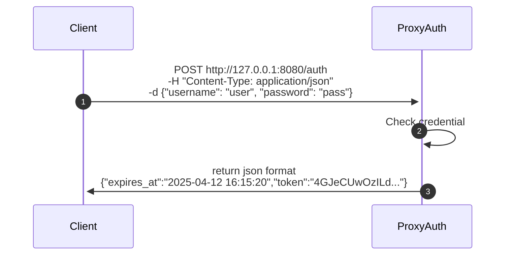
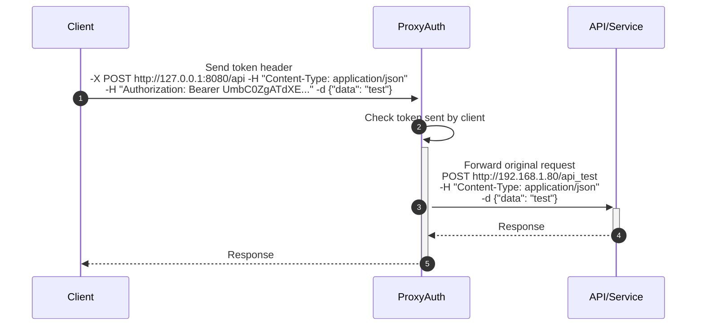
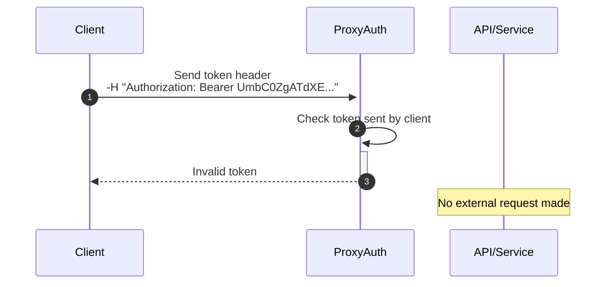

<div align="center">
<h1>ProxyAuth (Community Edition)</h1>
<br>

</div>
<br>


[](https://github.com/vBlackOut/ProxyAuth/actions/workflows/proxyauth.yml)


[](https://crates.io/crates/proxyauth)

[](https://discord.gg/sKPRWzYdCy)

💣 ProxyAuth is a universal reverse proxy authentication gateway, capable of securing any backend application, API, or dashboard — without changing a single line of their code.

ProxyAuth sits in front of your backend and handles authentication and access control for you. It encrypts tokens using ChaCha20 + HMAC-BLAKE3, with config-defined secrets, hashes passwords with Argon2 (auto-generated salts), and ships with built-in rate limiting on both the proxy and the auth route. It's extremely fast, handling **~180,000+ requests/second** under load.

## Documentation
<a href="http://proxyauth.app">View the documentation</a>
<b>Want to contribute to the documentation? See <a href="https://github.com/vBlackOut/ProxyAuth-Docs">ProxyAuth Docs</a></b> :heart:

## Password hashing (Argon2)
Passwords in `config.json` can be entered in plain text. On first startup, ProxyAuth automatically hashes them with Argon2 (auto-generated salt) and rewrites the file — you never need to hash a password by hand.

## Rate limiting
- Rate limiting is applied **per user**, not per token. So if someone generates 150 tokens and uses them all simultaneously, the limit still applies to the user as a whole — not per individual token, unlike more traditional systems. This applies to every route managed by ProxyAuth.
- The `/auth` route has its own rate limit, protecting against brute-force and credential-stuffing attacks.
- All limits (`burst`, `block_delay`, `requests_per_second`) are configurable via `config.json`, with no code changes required — a middleware layer evaluates every incoming request and applies the configured limits.

## ProxyAuth Usage

### Configuration files

<details>
<summary><code>routes.yml</code></summary>

```yaml
routes:
  - prefix: "/redoc"
    target: "http://127.0.0.1:8000/redoc"
    required_login: false

  - prefix: "/api_test/openapi.json"
    target: "http://localhost:8000/api_test/openapi.json"
    required_login: false

  - prefix: "/api_test"
    target: "http://localhost:8000/api_test"
    required_login: true
    username: ["admin", "alice1", "alice15", "alice30"]
    proxy: true                                # optional — forward this route through a proxy
    proxy_config: "http://myproxyurl:8888"      # required if proxy: true
    cert: {"file": "certificat.pk12", "password": "1234"}  # /!\ experimental, untested since v0.5.0 /!\
```

- `required_login: false` — public route, no authentication required.
- `required_login: true` — the client must present a valid token; optionally restrict access to specific users with `username: [...]`.

> **Migrating from an older config?** The `secure` key was renamed to `required_login`. ProxyAuth will refuse to start and tell you exactly which route(s) still use the old key if you forget to update `routes.yml`.

</details>

<details>
<summary><code>config.json</code></summary>

```json
{
  "token_expiry_seconds": 3600,
  "secret": "supersecretvalue",
  "host": "127.0.0.1",
  "port": 8080,
  "log": {"type": "local"},
  "ratelimit_proxy": {
    "burst": 100,
    "block_delay": 500,
    "requests_per_second": 10
  },
  "ratelimit_auth": {
    "burst": 10,
    "block_delay": 500,
    "requests_per_second": 10
  },
  "worker": 4,
  "users": [
    { "username": "admin", "password": "admin123" },
    { "username": "bob", "password": "bobpass" },
    { "username": "alice1", "password": "alicepass" }
  ]
}
```

Use `"log": {"type": "loki", "host": "http://host_loki:port"}` instead of `"type": "local"` to ship logs to Loki.

On first run (if `config.json`/`routes.yml` don't exist yet), ProxyAuth generates a working default pair of files for you locally, so you can start the server immediately and adjust from there.

</details>

<details>
<summary><code>databases</code> — shared users across multiple instances (optional)</summary>

By default, users live in the `users` array of `config.json`, which means each instance keeps its own copy — creating a user means editing every instance's file. If you're running several ProxyAuth instances (load-balanced, multi-server, or containerized), you can instead point them all at one shared PostgreSQL or MySQL/MariaDB database: create a user once, every instance picks it up immediately.

```jsonc
// databases (optional)
// Connect ProxyAuth to a shared PostgreSQL or MySQL/MariaDB database
// to store and load users centrally, instead of duplicating the
// "users" list in every instance's config.json.
//
// "port" is optional (defaults to 5432 for postgres, 3306 for mysql).
"databases": {
  "type": "postgres",
  "host": "127.0.0.1",
  "db_name": "proxyauth",
  "user": "proxyauth",
  "password": "changeme"
}
```

- `type`: `"postgres"` or `"mysql"` (also accepts `"mariadb"`).
- On startup, ProxyAuth connects, creates the `users` table if it doesn't exist yet, and merges any users found there into the running config (DB users take precedence over file users with the same username). A database outage never blocks startup — file-based users still work.
- Add or update a user directly in the database from the CLI:
  ```bash
  proxyauth db-add-user --username admin
  ```

**Build requirements** — Diesel needs the client libraries for whichever backend(s) you use:

| Distro         | PostgreSQL                | MySQL/MariaDB                    |
|-----------------|---------------------------|-----------------------------------|
| Debian/Ubuntu   | `libpq-dev`                | `default-libmysqlclient-dev` (or `libmariadb-dev`) |
| Manjaro/Arch    | `postgresql-libs`          | `mariadb-libs`                    |

Also make sure `pkg-config` (or `pkgconf` on Arch) is installed so the build scripts can find the libraries automatically.

</details>

<details>
<summary>Install on the server</summary>

```bash
curl -fsSL https://proxyauth.app/sh/install | bash
```
</details>
<details>
<summary>Uninstall on the server</summary>

```bash
curl -fsSL https://proxyauth.app/sh/uninstall | bash
```
</details>

<details>
<summary>Easy launch ProxyAuth</summary>

```bash
sudo systemctl start proxyauth
```
</details>

<details>
<summary>Use on Docker</summary>

```bash
docker compose build
docker compose up -d
```
</details>

<details>
<summary>Override configuration on Docker</summary>

Mount your own config files over the defaults:

```yaml
volumes:
  - ./config/config.json:/app/config/config.json
  - ./config/routes.yml:/app/config/routes.yml
```

Then restart the container:
```bash
docker compose restart
```
</details>

## TODO
- Log to stdout using `tracing` (Rust log lib) [still being deployed]
- ~~Protect passwords in `config.json` using Argon2.~~ [Done v0.4.0]
- ~~Add Loki integration with tracing.~~ [Done ≥v0.5.2]
- ~~Add revoke token method. Bonus: multi-cluster via Redis.~~ [Done v0.8.3]
- ~~Shared user storage across instances via PostgreSQL/MySQL.~~ [Done]

## ProxyAuth Advantages
- Centralized access point for authentication and access control.
- Secure tokens using ChaCha20 (HMAC-BLAKE3 + rotation) — define the same secret across every instance to get consistent token calculations (when using the same image).
- Tokens can be recalculated using a random exponential factor, adding further complexity.
- Logs can be shipped via Loki [≥v0.5.2].
- Optionally back users with a shared PostgreSQL/MySQL database instead of duplicating `config.json` across instances.

## Potential disadvantages
- If someone reverse-engineers the hash, they could potentially gain access. This is why you must define a secure secret (64+ characters!) in the config. The same principle is used by Django for password hashing via PBKDF2: https://docs.djangoproject.com/en/5.1/ref/settings/#std-setting-SECRET_KEY

## Failover
<details>
<summary>Failover overview</summary>

</details>

## ProxyAuth Structure
The server behaves like an authentication proxy.

Refresh token route:


#### Scenario 1: Valid token


#### Scenario 2: Invalid token


ProxyAuth lets you apply global authentication to any application without it needing to implement token validation itself — simplifying every future integration.
